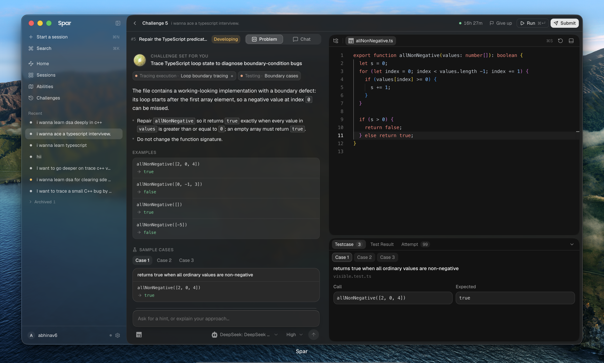
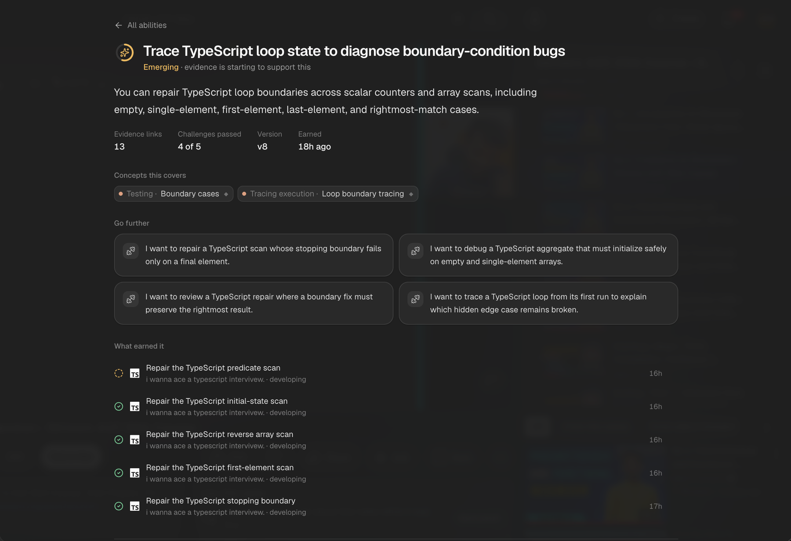
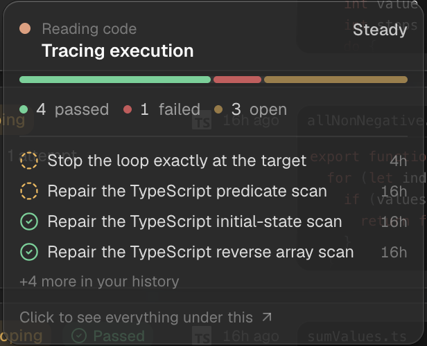
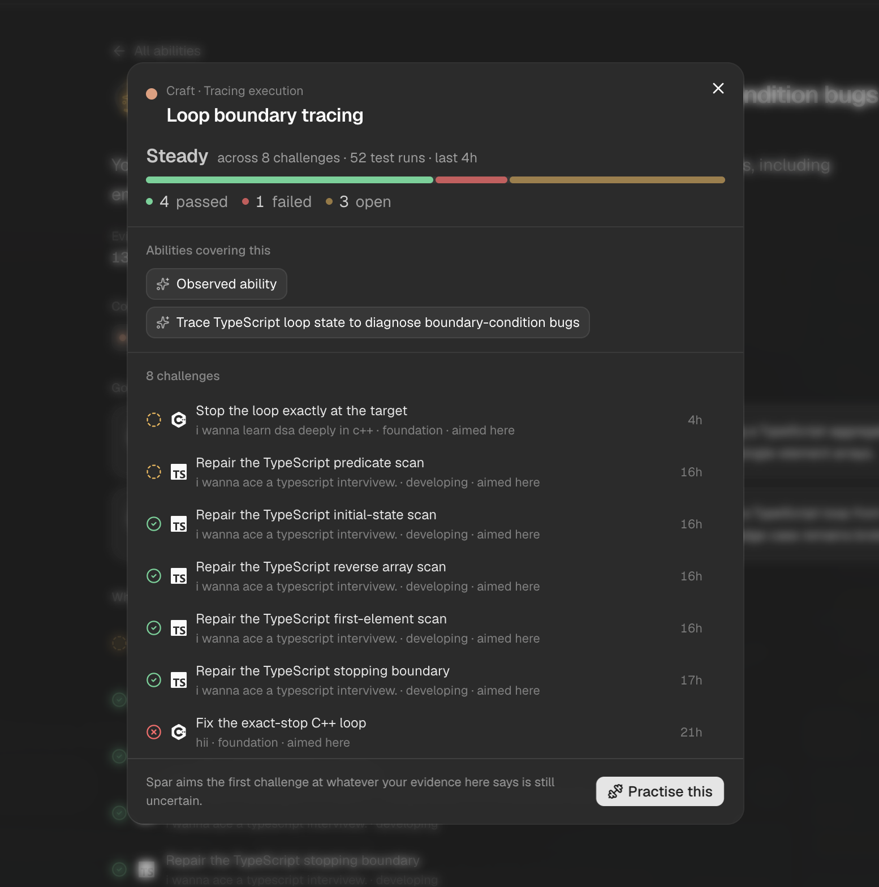
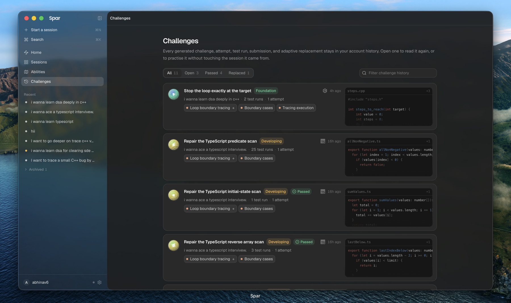

<p align="center">
  <picture>
    <source media="(prefers-color-scheme: dark)" srcset="docs/assets/icon-dark.png">
    <source media="(prefers-color-scheme: light)" srcset="docs/assets/icon-light.png">
    
  </picture>
</p>

<h1 align="center">Spar</h1>

<p align="center">
  A coding gym that watches you work and writes your next exercise.
  <br>
  macOS · Windows · Linux — <a href="https://github.com/AbhinavMishra32/spar/releases/latest">download the latest release</a>
</p>

---

## The problem with practising alone

Practice sites hand everyone the same ladder. You pick a problem, you solve it or
you don't, and nothing about the next problem knows what happened in the last
one. Get stuck on the same thing four times and the site will happily let you get
stuck a fifth. Solve something by luck and it counts the same as understanding it.

Spar is built the other way round. It watches how an attempt actually goes — what
you wrote, what you ran, where you stalled, what finally passed — and uses that to
decide what you should face next. The exercises are written for you, on the spot,
against the specific thing it thinks you can't do yet.

The result is closer to sparring with someone who has been watching you than to
working through a list.

<p align="center">
  
</p>

<p align="center">
  <sub>A challenge Spar wrote after watching four earlier attempts. The bug is real,
  the tests are committed, and the clock top-right has been running since the
  attempt opened.</sub>
</p>

## Getting Spar

Grab the build for your machine from the
[latest release](https://github.com/AbhinavMishra32/spar/releases/latest).

| Your machine | Download |
| --- | --- |
| Mac, Apple silicon (M1 and later) | `Spar-0.3.1-arm64.dmg` |
| Mac, Intel | `Spar-0.3.1.dmg` |
| Windows | `Spar-0.3.1-x64.exe` |
| Linux | `Spar-0.3.1-x86_64.AppImage` or `Spar-0.3.1-amd64.deb` |

**v0.3.1 builds are not code-signed yet.** Your operating system will say so, in
its usual alarming way. On a Mac, right-click the app and choose *Open* the first
time rather than double-clicking it, or run
`xattr -d com.apple.quarantine /Applications/Spar.app`. On Windows, choose *More
info* → *Run anyway* in the SmartScreen dialog. Signed builds are the next thing
on the list.

### What you need before Spar is useful

Two things, and it is worth knowing about both before you download:

**A model to run the agent on.** Spar doesn't ship one, and doesn't resell one.
You point it at a model you already pay for or run yourself — see
[Bring your own model](#bring-your-own-model) below. There is no Spar
subscription.

**A place for your account and history to live.** Spar signs you in against the
Spar API, and a release is stamped with the origin it should talk to. If the build
you downloaded was cut before a Spar API was deployed, it falls back to
`http://localhost:4318` and the sign-in screen says so plainly rather than
reporting a refused connection — in which case you run the API yourself.
[`docs/hosting.md`](docs/hosting.md) covers both paths: deploying it to Vercel in
a few commands, or running it locally. `SPAR_API_ORIGIN` overrides the stamp
whenever you would rather point somewhere else.

## Your first session

**You answer seven questions, once.** Your name, roughly where you are in your
career, what you want to get better at, where you tend to get stuck, which
language challenges should use, which model the agent should run on, and — this
one is optional — whether to connect a problem provider like LeetCode. The one
about getting stuck is worth answering properly: "I can read async code but I
never know what actually needs awaiting" gives Spar somewhere to start, and "I'm
bad at algorithms" doesn't.

You answer them once per account, not once per machine. The answers live on your
account, so signing in on another computer picks up where you left off rather
than starting the intake again.

**Spar reads that and makes an opening call.** It has no evidence about you yet,
so it treats everything you said as a hypothesis rather than a fact, picks
something to probe, and tells you what it's about to do and why before it does it.

**You get a challenge.** A problem statement, a workspace with real files, a test
suite you can run, and a terminal. Not a text box with a function signature in
it — a small project you open and work in.

**You work, and Spar watches.** Your attempt is being recorded as it happens:
edits, runs, the tests you ran and what they said, how long you sat on each part.
A clock runs while the attempt is open, because every moment in the replay of
your solve is measured from that zero.

**You submit, and the tests decide.** Not the model — the tests. More on why that
matters below.

**Spar tells you what it learned.** Not a score. A statement about what your
attempt is evidence of, and what it wants to check next. That becomes the target
for your next challenge.

## What's in the app

### Challenges written for you, proven before you see them

Every challenge is generated for the target Spar has picked, which means nobody
else is getting your exercise and you can't look up the answer.

Generated exercises have an obvious failure mode: sometimes the tests are wrong,
or the problem is impossible, or the "correct" solution doesn't actually pass. So
before a challenge is ever shown to you, it has to survive a mechanical check:

- the reference solution passes every test, visible and hidden;
- deliberately broken versions of the solution pass the visible tests — proving
  the visible suite is genuinely incomplete, which is what makes hidden tests
  mean anything;
- those broken versions fail the hidden tests;
- and the files, commands, and language all agree with each other.

A challenge that fails any of these never reaches you. You will never lose twenty
minutes to a broken problem.

### Verdicts you can trust

Your submission is graded by running the committed tests and reading the exit
code. There is no model in that path. Nothing you write to the agent, and nothing
the agent decides it likes about you, can turn a failing program into a passing
submission — or the reverse.

This is the line Spar draws down the middle of itself: the agent proposes what
you should practise and explains what your work shows, and it is never the
authority on whether your code is correct. A tutor that can be talked into
agreeing with you is not measuring anything.

An attempt ends when a submission passes. Not when you run out of patience, not
when the model decides it's satisfied.

### The workspace

A file tree, a real editor, the problem statement, your test results, and a
terminal — laid out in panes you can resize, in one window.

Alongside it sits the agent. You can ask it things mid-attempt, and it can ask
you things back. It says what it is about to do before each phase, so you are
never watching a spinner wondering what's happening. Its thinking is labelled by
what it was actually doing, not by how long it took.

The panel under the editor is where a run lands. **Testcase** is what the visible
suite declares — the call and the expected value, before you run anything.
**Test Result** fills in per-case verdicts once you do, selecting the first
failure for you rather than making you hunt for it. **Attempt** is the replay:
every edit and run, timestamped from the moment the attempt opened.

While anything is running, the app animates its own logo — the dot grid waking up
along its diagonal — instead of a generic spinner. Small thing, but you see it
during every test run, so it may as well be Spar's.

### The ability ledger

The page that answers "what am I actually good at now".

It keeps two kinds of thing strictly apart. An **earned** ability is one your
submissions have demonstrated, more than once. An **uncertain** one is a
hypothesis Spar wrote when it set a target — a guess it hasn't confirmed. They
are drawn differently and never merged, because a page that shows a guess in the
same style as three passing submissions is claiming things on your behalf, and
that is the one thing an abilities page must never do.

The ledger is the thing that grows. It is also the thing Spar reads before it
picks your next challenge.

<p align="center">
  
</p>

Open one and it has to show its work. The claim is stated in plain language —
*you can repair TypeScript loop boundaries across scalar counters and array
scans* — and everything under it is the receipt: how many pieces of evidence
back it, how many challenges you passed of those aimed here, which version of
the claim this is (it gets rewritten as evidence accumulates), and the exact
list of attempts that earned it. **Go further** turns the ability into the next
session's goal, phrased narrowly enough to be worth an hour.

### Concepts

Every challenge is tagged with what it exercises. Hover any of those tags —
anywhere in the app — and you get a straight answer about that concept: passed,
failed, still open, and the attempts behind each.

<p align="center">
  
</p>

Click through and the full sheet opens on everything you have ever done under
that concept — which abilities cover it, all the challenges that touched it, and
a button that starts a new session aimed squarely at it. This is how you find out
whether "closures" is a real gap or one bad afternoon.

<p align="center">
  
</p>

### Sessions and history

Work is organised into sessions, each with a goal you set and targets Spar
derives from it. The dashboard shows recent ones with live progress while the
agent is working; the sessions page holds the full history. Nothing is thrown
away — a session you abandoned is still evidence.

<p align="center">
  
</p>

Every challenge Spar has ever written for you stays here, filterable by whether
it is open, passed, or was replaced — Spar swaps a challenge out when your
evidence moves on before you got to it, and it says so rather than quietly
dropping it. Each row carries the session it came from, the concepts it exercises,
how many times you ran the tests, and a peek at the file. Open any of them to read
it again, or to practise it without touching the session it belongs to.

### Real problems, when a real problem fits

Spar writes most of your challenges. It does not have to write all of them.

Connect LeetCode or Codeforces in Settings and the agent can set you real problems alongside
the ones it invents — chosen against the same target, tagged into the same
ability ledger, and sitting in the same history. You sign in on LeetCode's own
page; Spar never sees your password, and every method that page offers works.

The agent is *made* to look. On any turn that sets a challenge it searches the
source first, and then has to either assign what it found or consciously write
its own. That is a property of the controller rather than a line in a prompt: it
cannot skip the search, and it cannot end the turn without setting something.

Which one it picks is a judgement, and both directions are real. A sourced
problem brings a difficulty other people calibrated, hidden cases nobody in Spar
wrote, and your own history with it. A challenge written for your specific
misconception brings something no library has. Spar is told to prefer the real
problem when it genuinely lands on the target — and not to hand you a contest
problem to test an off-by-one.

**Solving one counts where you'd expect it to.** Submit, and it goes to the selected source's
judge and runs against every hidden case that problem has. The verdict is theirs,
and it appears on that account like any other submission. LeetCode also exposes a
**Run there** button for trying it without spending a submission. Codeforces does
not offer that endpoint, so **Run** checks its published stdin/stdout examples
locally and **Submit** is the only action that reaches Codeforces.

Not connected, or you would rather your code stayed on your machine? Both are
fine, and Spar says which is happening rather than blurring it. Locally-graded
problems are checked against the examples published with the problem — real, and
weaker than an acceptance — and Spar will never describe one as accepted. A
problem it can neither judge nor run is refused rather than set.

It also reads what you have already done there: what you solved, and more
usefully what you attempted and walked away from. That is treated as evidence of
exposure, not of understanding — the ability ledger still decides what you can
do, on your own attempts.

### Bring your own model

Spar is a client for whatever model you want to drive it with.

**Sign in with a subscription you already have** — OpenAI Codex, Claude Code, or
GitHub Copilot, through their own sign-in flow. No API key to paste, and your
existing plan covers the usage.

**Or use an API key** for OpenAI, Anthropic, Google, xAI, DeepSeek, Moonshot,
Z.ai, MiniMax, OpenRouter, Cline, Vercel AI Gateway, Cloudflare AI Gateway, or
any OpenAI-compatible endpoint you can name.

**Or run it locally** with Ollama or LM Studio, and never send your work
anywhere.

You pick the model and the reasoning effort in settings, and change them whenever
you like. Keys are held in your operating system's keychain, not in a config file
in your home directory.

### Details that make it feel like an app

It follows your system appearance, or you can pin it to light or dark. There's a
command palette for getting anywhere quickly. On a Mac it uses the real window
material, so it sits on your desktop like something native rather than a web page
in a frame. The app icon is drawn on the measured macOS 26 squircle rather than an
approximation of it, and follows your appearance for as long as Spar is running.

Every waiting state in the app is the logo rather than a borrowed spinner: the
dot grid runs a diagonal wave while something is being produced, and breathes
while something is being read. Different motion for different kinds of waiting,
so the app tells you which one you are in.

## Current limits

Being straight about the edges:

- **Ten languages.** JavaScript, TypeScript, Python, Java, C, C++, Go, Rust,
  Swift, and Ruby are available for Spar-authored challenges. A source problem
  is mounted only when its language is supported by the source integration.
- **Two practice sources.** LeetCode and Codeforces. HackerRank and CodeChef are
  shown as planned sources, not working integrations.
- **Hosting is yours to set up.** There is no Spar-operated service; you deploy the API or run it locally, as described above.
- **Unsigned builds.** Your OS will complain on first launch.
- **macOS is the polished one.** The Windows and Linux builds are real, but the
  Mac is where the window chrome, materials, and window controls have had the
  attention.
- **Updates check automatically.** Spar checks each packaged release when it
  opens and while it remains running. On unsigned macOS and Windows builds, the
  operating system can still require a manual approval or install.

## Where your work lives

Your code, your attempt history, and your ledger belong to you, and it's worth
knowing exactly where each thing sits.

**On your machine:** the challenge files you work in, your in-flight attempt
state, your settings, and a working copy of your history. Model API keys go to
the system keychain.

**On the backend you point Spar at:** your account, and the canonical copy of
your learning history, so it survives a reinstall and follows you to another
machine.

**To your model provider:** the contents of the challenge and the conversation
you have with the agent, because that is what running a model means. If that
matters for your work, run a local model — Spar treats Ollama and LM Studio as
first-class options for exactly this reason.

Spar has no analytics and no telemetry.

## For developers

This repository is the whole product: the desktop app, the API, the
deterministic challenge compiler, and the landing page.

- [`docs/architecture.md`](docs/architecture.md) — how the processes are split and
  why the renderer is treated as untrusted
- [`docs/threat-model.md`](docs/threat-model.md) — what runs untrusted code and
  what contains it
- [`docs/practice-sources.md`](docs/practice-sources.md) — how a source of real
  problems is plugged in, who grades what, and the MCP surface it is served over
- [`docs/hosting.md`](docs/hosting.md) — deploying the API, and how a build
  learns which one to talk to
- [`docs/releasing.md`](docs/releasing.md) — how a release is cut
- [`apps/web/README.md`](apps/web/README.md) — the landing page, and the one
  file to edit to change Spar's typeface
- [`apps/desktop/scripts/icon/README.md`](apps/desktop/scripts/icon/README.md) —
  how the app icon's macOS geometry was measured

Running it locally, on macOS with Node 22 and pnpm 10.13.1:

```bash
corepack pnpm install
corepack pnpm dev
```

The first run asks for a PostgreSQL connection URL and object-storage
credentials, writes them to a git-ignored `.env.local`, applies migrations,
creates the artifact bucket, and starts the API and the app together. Any
Postgres will do — the hosted deployment runs on [Neon](https://neon.tech) — and
object storage is a Supabase project or anything S3-compatible. After that,
`corepack pnpm dev` is the whole command.
