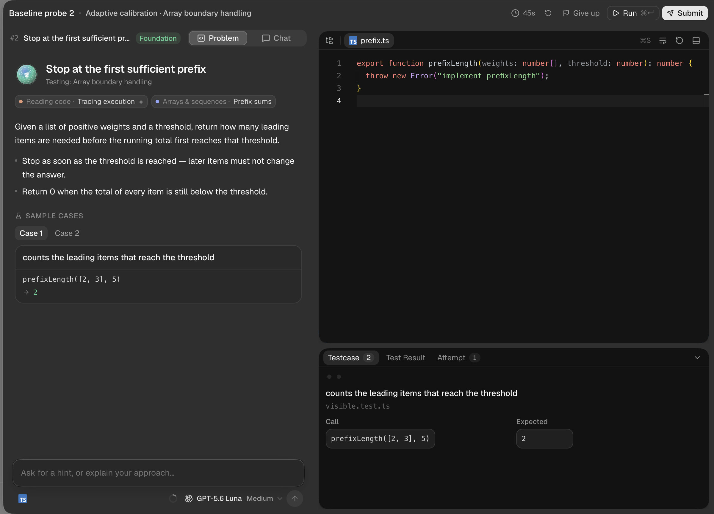
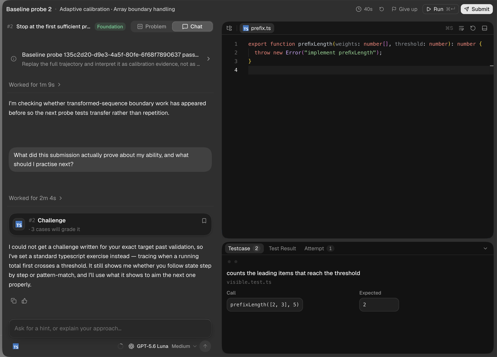
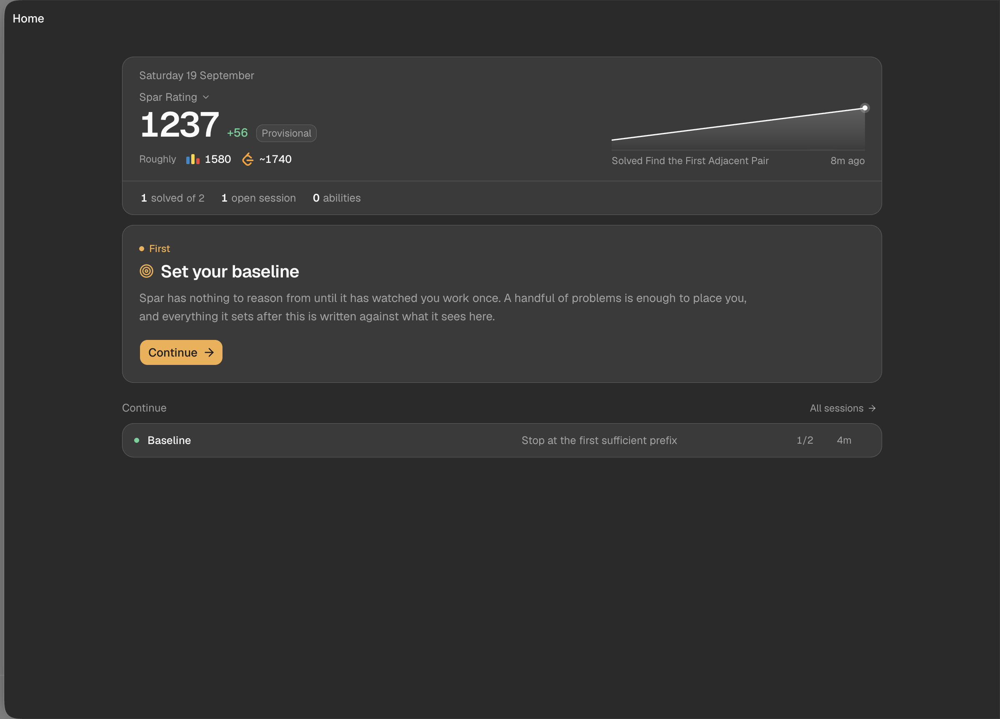
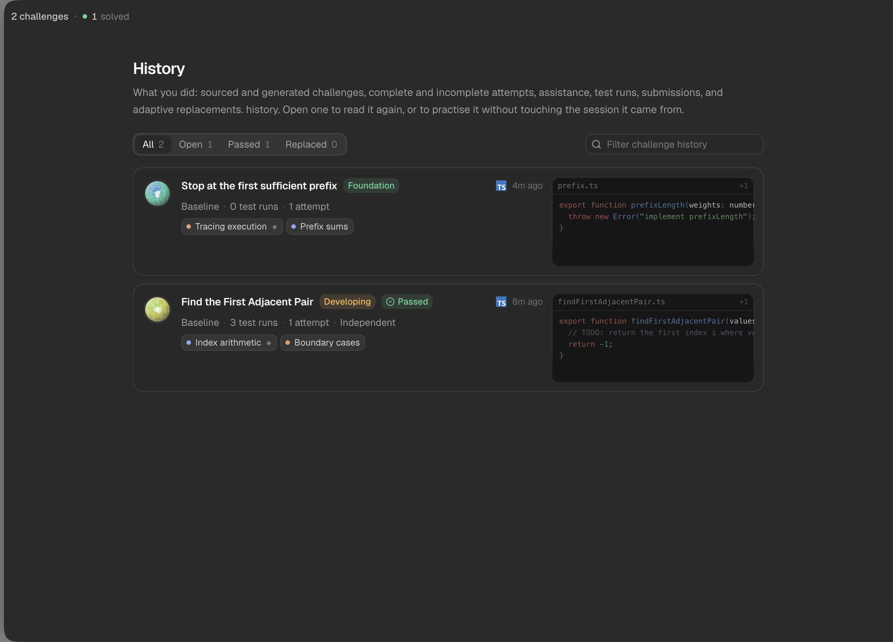
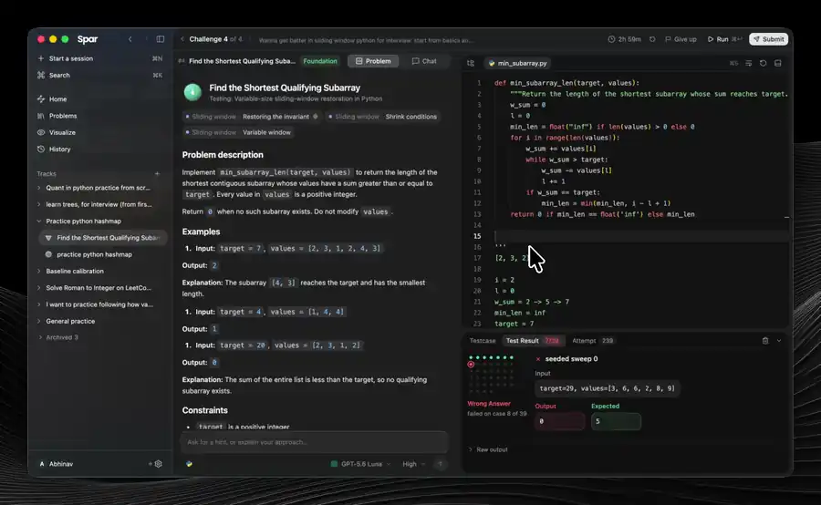

<p align="center">
  <picture>
    <source media="(prefers-color-scheme: dark)" srcset="docs/assets/icon-dark.png">
    <source media="(prefers-color-scheme: light)" srcset="docs/assets/icon-light.png">
    
  </picture>
</p>

<h1 align="center">Spar</h1>

<p align="center">
  A coding gym that watches you work and writes your next exercise.
  <br>
  macOS · Windows · Linux — <a href="https://github.com/AbhinavMishra32/spar/releases/latest">download the latest release</a>
</p>

---

Practice sites hand everyone the same ladder, and nothing about the next problem
knows what happened in the last one. Spar works the other way round: it watches
how an attempt actually goes — what you wrote, what you ran, where you stalled,
what finally passed — and writes your next exercise against the specific thing it
thinks you can't do yet.

<p align="center">
  
</p>

<p align="center">
  <sub>A live Maya Chen session: Spar has written a second TypeScript probe after
  reading the first attempt. The workspace is a real executable challenge, not a
  marketing mockup.</sub>
</p>

## Getting Spar

Grab the build for your machine from the
[latest release](https://github.com/AbhinavMishra32/spar/releases/latest) — a
`.dmg` for Mac (Apple silicon or Intel), an `.exe` for Windows, an `.AppImage` or
`.deb` for Linux.

**Builds are not code-signed yet**, so your OS will say so in its usual alarming
way. On a Mac, right-click the app and choose *Open* the first time, or run
`xattr -d com.apple.quarantine /Applications/Spar.app`. On Windows, choose *More
info* → *Run anyway*.

Two things are yours to bring. **A model:** Spar doesn't ship one or resell one —
point it at something you already pay for or run yourself. **A backend:** Spar
signs you in against the Spar API, and there is no Spar-operated service, so you
deploy it or run it locally. [`docs/hosting.md`](docs/hosting.md) covers both in
a few commands.

## Your first session

You answer seven questions once per account: who you are, what you want to get
better at, where you tend to get stuck, which language, which model, and
optionally a problem provider. The one about getting stuck is worth answering
properly — *"I can read async code but I never know what actually needs awaiting"*
gives Spar somewhere to start, and *"I'm bad at algorithms"* doesn't.

Then you get a challenge: a problem statement, a workspace with real files, a
test suite, and a terminal. Not a text box with a function signature in it. You
work, and the attempt is recorded as it happens — edits, runs, what the tests
said, how long you sat on each part. You submit, the tests decide, and Spar tells
you what your attempt was evidence of and what it wants to check next. That
becomes the target for the next one.

## Spar in one minute

Spar is a coding gym that builds a private practice loop around your actual
behaviour. It is not a course with a fixed chapter order, a chatbot that hands
you random exercises, or a leaderboard that only counts accepted answers.

The useful distinction is this:

- A normal practice site stores whether you got an answer right.
- Spar stores what happened while you got there: the edits, test runs, pauses,
  questions, failed cases, recovery, and final submission.
- The training agent turns that trajectory into a hypothesis about what to test
  next.
- Deterministic code, not the agent, runs the tests and decides correctness.

That gives Spar two jobs with a hard boundary between them. The agent is a
coach and a curriculum planner: it chooses a useful next question, explains
what the evidence means, and can help you inspect your own code. The host is the
measurement system: it owns permissions, challenge validation, execution,
submission state, persistence, limits, and the pass/fail verdict.

## The learning loop

Every session follows the same basic loop, even when the challenge comes from
LeetCode or Codeforces instead of Spar's generator.

1. **Profile.** Tell Spar your language, experience, goals, and the thing that
   currently surprises you. Specific observations are more useful than a label:
   “I lose the loop invariant when the window shrinks” gives the agent something
   to investigate.
2. **Target.** Spar reads the ability map, recent history, open sessions, and
   the last failure. It chooses whether to reinforce, isolate, transfer, or move
   on from an ability.
3. **Set the challenge.** The agent searches a connected source when one fits;
   otherwise Spar generates an exercise. Generated challenges are mechanically
   validated before they reach you.
4. **Work.** You edit real files in the workspace. Every edit, run, question,
   and response becomes part of the attempt trajectory.
5. **Inspect.** Run visible cases early. Ask for a hint, explain an approach,
   or ask the agent to trace a suspicious line. Assistance is part of the
   evidence, not something hidden from the record.
6. **Submit.** Spar runs the committed test suite. The result is per-case and
   reproducible; the model is not in the judging path.
7. **Interpret.** The agent explains what the attempt supports, what is still
   uncertain, and why the next exercise is different. That explanation is a
   hypothesis to test, not a grade to blindly accept.
8. **Repeat.** History, concepts, abilities, and future targets become more
   specific as the evidence accumulates.

## A guided first session

### 1. Install and connect the two things Spar needs

Download a release for your operating system and open the app. Spar needs a
backend for your account and learning history, and a model provider for the
training agent. The release does not hide a shared Spar account or resell model
tokens.

For the model, choose one of the supported sign-in providers, enter an API key,
use an OpenAI-compatible endpoint, or connect a local Ollama/LM Studio model.
Keys are stored in the operating system keychain. A subscription sign-in is
still your provider account: Spar does not receive or store your provider
password.

If you are testing the desktop app locally, the repository's development
commands can start the API and renderer together. See [`docs/hosting.md`](docs/hosting.md)
for backend setup and [`docs/architecture.md`](docs/architecture.md) for the
process boundaries.

### 2. Answer onboarding like a coach would need you to

Spar asks about your experience, focus, language, and sticking point. This is
not a personality quiz. It seeds the first target, so concrete answers help:

```text
Weak:  “I need to get better at algorithms.”
Useful: “I find the right data structure, then lose track of the invariant when
         an edge case changes the loop boundary.”
```

Choose a language you can read and edit comfortably. You can change direction
later; the point of the first session is to create evidence, not to lock your
identity forever.

### 3. Take the baseline seriously, but do not try to perform

The baseline is calibration. Spar is trying to see how you reason, not whether
you can guess the expected answer quickly. Read the prompt aloud to yourself,
write down the invariant or state you think matters, run a small case, and ask
for help when you would ask a human coach.

A wrong first attempt is useful. An unexplained perfect-looking solution is
less informative than a short trajectory that shows where your reasoning became
uncertain.

### 4. Use the workspace in this order

1. Read the statement and identify the input, output, and boundary cases.
2. Inspect the starter file and the visible cases.
3. Write a small plan before editing. For boundary-heavy problems, write the
   valid index range or loop invariant explicitly.
4. Make the smallest useful edit.
5. Run visible cases. A failing case is a question about your model of the
   program, not a reason to immediately ask for the answer.
6. Use Chat when a hint, trace, or explanation will unblock you.
7. Re-run after each meaningful change, then submit when the result is yours.

The tabs have distinct jobs. **Problem** is the prompt and cases. **Chat** is
the conversation and the agent's reasoning about the session. The editor is the
file you are actually changing. The panel below it separates **Testcase** (the
declared cases), **Test Result** (what ran), and **Attempt** (the recorded
replay).

### 5. Read the next target as feedback

After submission, look for three things:

- What the tests proved about the code.
- What the trajectory suggested about the reasoning process.
- What changed in the next challenge and why.

Spar may choose a smaller diagnostic, a transfer problem with unfamiliar
surface details, or another exercise at the same weakness. That is intentional:
solving one familiar problem demonstrates less than finding the same idea when
the prompt no longer advertises it.

## A real session, with fictional demo data

The following captures use a fictional account named Maya Chen. They contain no
personal user data. Maya solved **Find the First Adjacent Pair**, a boundary
exercise, then asked what the submission actually proved. The GPT-5.6 Luna
agent inspected the trajectory and produced **Stop at the first sufficient
prefix** as a different TypeScript probe. The second challenge was left open so
the screenshots show the honest state of a learning session rather than a
perfectly staged completion.

<p align="center">
  
</p>

<p align="center">
  <sub>The agent reads the attempt as calibration evidence, answers a direct
  question about ability, and explains why the next probe is different.</sub>
</p>

<p align="center">
  
</p>

<p align="center">
  <sub>Home is the orientation surface: rating movement, what is solved, what is
  open, and the next session to continue.</sub>
</p>

<p align="center">
  
</p>

<p align="center">
  <sub>History keeps the receipt: challenge state, concepts, test runs, attempts,
  and the ability to reopen a past problem without changing its original session.</sub>
</p>

## How to get better evidence

Spar becomes more useful when the attempt reflects how you really learn.

- **State the uncertainty.** “I do not know whether this pointer moves before
  or after the check” is actionable; “give me a hint” is less so.
- **Run before you feel ready.** Small cases reveal whether the plan and the
  implementation agree.
- **Use edge cases deliberately.** Empty input, one item, duplicate values,
  the last valid index, thresholds at zero, and already-satisfied prefixes are
  often where an invariant shows itself.
- **Ask for a trace.** Spar can inspect execution when a value changes in a way
  that is easier to see than describe.
- **Do not erase the struggle.** Reverting a bad edit is fine; hiding every
  failed thought makes the evidence less representative.
- **Return to history.** Replaying a passed challenge without changing the
  original record is a good way to test whether the idea stuck.
- **Treat abilities as claims with receipts.** An uncertain ability is a target
  Spar wants to test. An earned ability has repeated supporting submissions.

## What Spar does not promise

The agent can misunderstand your intent, generate a target that needs to be
replaced, or explain a trajectory imperfectly. Spar surfaces that uncertainty
and keeps the mechanical parts deterministic; it does not pretend that a model
is an infallible teacher.

The first few sessions are also not a final ranking. They are a calibration
period. The rating is provisional, abilities may be uncertain, and a challenge
can be replaced when it cannot be validated or no longer tests the intended
thing. Those states are information about the measurement process, not a
failure you need to hide.

## What's in the app

### Challenges written for you, proven before you see them

Every challenge is generated for the target Spar picked, so nobody else is
getting your exercise and you can't look up the answer.

Generated exercises have an obvious failure mode — wrong tests, impossible
problems, a "correct" solution that doesn't pass. So before a challenge reaches
you it has to survive a mechanical check: the reference solution passes every
test; deliberately broken versions pass the *visible* tests, proving that suite
is genuinely incomplete; those broken versions fail the hidden ones; and the
files, commands and language all agree. A challenge that fails any of these never
reaches you.

### Verdicts you can trust

Your submission is graded by running the committed tests and reading the exit
code. There is no model in that path. Nothing you write to the agent, and nothing
it decides it likes about you, can turn a failing program into a passing
submission — or the reverse.

This is the line Spar draws down the middle of itself: the agent proposes what
you should practise and explains what your work shows, and it is never the
authority on whether your code is correct. A tutor that can be talked into
agreeing with you is not measuring anything.

<p align="center">
  
</p>

<p align="center">
  <sub>A submission going through: the tests run, each case reports back, and the
  first failure is selected for you with its input, your output and the expected
  value side by side.</sub>
</p>

### The workspace

A file tree, a real editor, the problem statement, test results and a terminal,
in resizable panes in one window. Alongside them sits the agent: you can ask it
things mid-attempt, and it can ask you things back. It says what it is about to
do before each phase, so you are never watching a spinner wondering what is
happening.

The panel under the editor is where a run lands. **Testcase** is what the visible
suite declares before you run anything. **Test Result** fills in per-case
verdicts, selecting the first failure rather than making you hunt for it.
**Attempt** is the replay: every edit and run, timestamped from the moment the
attempt opened.

### The ability ledger

The page that answers "what am I actually good at now".

It keeps two things strictly apart. An **earned** ability is one your submissions
have demonstrated, more than once. An **uncertain** one is a hypothesis Spar
wrote when it set a target. They are drawn differently and never merged, because
a page that shows a guess in the same style as three passing submissions is
claiming things on your behalf.

<p align="center">
  
</p>

Open one and it shows its work: the claim in plain language — *you can repair
TypeScript loop boundaries across scalar counters and array scans* — and under it
the receipt. How much evidence backs it, which version of the claim this is, and
the exact attempts that earned it. **Go further** turns it into the next
session's goal.

### Concepts

Every challenge is tagged with what it exercises. Hover a tag anywhere in the app
for a straight answer about that concept — passed, failed, still open, and the
attempts behind each. Click through for everything you have ever done under it,
and a button that starts a session aimed squarely at it. This is how you find out
whether "closures" is a real gap or one bad afternoon.

<p align="center">
  
</p>

Work is organised into sessions, and nothing is thrown away — a session you
abandoned is still evidence. Every challenge Spar has ever written for you stays
in the history, filterable by open, passed, or replaced.

### Real problems, when a real problem fits

Connect LeetCode or Codeforces in Settings and the agent can set you real
problems alongside the ones it invents — same target, same ability ledger, same
history. You sign in on the source's own page; Spar never sees your password.

The agent is *made* to look: on any turn that sets a challenge it searches the
source first, then either assigns what it found or consciously writes its own.
That is a property of the controller, not a line in a prompt. A sourced problem
brings a difficulty other people calibrated and hidden cases nobody in Spar
wrote; a written one brings something no library has.

Submit a sourced problem and it goes to that judge, runs against every hidden
case, and appears on your account there like any other submission. Not connected?
Fine — Spar checks against the examples published with the problem and will never
describe that as an acceptance. A problem it can neither judge nor run is refused
rather than set.

### Bring your own model

**A subscription you already have** — OpenAI Codex, Claude Code or GitHub
Copilot, through their own sign-in. **An API key** for OpenAI, Anthropic, Google,
xAI, DeepSeek, Moonshot, Z.ai, MiniMax, OpenRouter, Cline, Vercel or Cloudflare
AI Gateway, or any OpenAI-compatible endpoint. **Or locally** with Ollama or LM
Studio, and never send your work anywhere.

Keys are held in your operating system's keychain, not in a config file in your
home directory.

## Current limits

- **Ten languages** for Spar-authored challenges: JavaScript, TypeScript, Python,
  Java, C, C++, Go, Rust, Swift, Ruby.
- **Two practice sources.** LeetCode and Codeforces; HackerRank and CodeChef are
  planned, not working.
- **Hosting is yours to set up.** There is no Spar-operated service.
- **Unsigned builds.** Your OS will complain on first launch.
- **macOS is the polished one.** Windows and Linux builds are real, but the Mac
  is where the chrome and materials have had the attention.

## Where your work lives

**On your machine:** the challenge files, your in-flight attempt, your settings,
and a working copy of your history. Model keys go to the system keychain.

**On the backend you point Spar at:** your account and the canonical copy of your
learning history, so it survives a reinstall and follows you to another machine.

**To your model provider:** the challenge and your conversation with the agent,
because that is what running a model means. If that matters for your work, run a
local model.

Spar has no analytics and no telemetry.

## For developers

This repository is the whole product: the desktop app, the API, the deterministic
challenge compiler, and the landing page.

- [`docs/architecture.md`](docs/architecture.md) — how the processes are split and
  why the renderer is treated as untrusted
- [`docs/threat-model.md`](docs/threat-model.md) — what runs untrusted code and
  what contains it
- [`docs/practice-sources.md`](docs/practice-sources.md) — how a source of real
  problems is plugged in, and who grades what
- [`docs/hosting.md`](docs/hosting.md) — deploying the API, and how a build learns
  which one to talk to
- [`docs/releasing.md`](docs/releasing.md) — how a release is cut

Running it locally, on macOS with Node 22 and pnpm 10.13.1:

```bash
corepack pnpm install
corepack pnpm dev
```

The first run asks for a PostgreSQL connection URL and object-storage
credentials, writes them to a git-ignored `.env.local`, applies migrations,
creates the bucket, and starts the API and the app together. After that,
`corepack pnpm dev` is the whole command.
